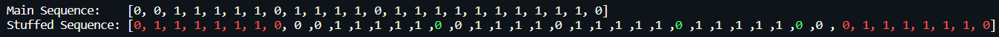

# Python library to perform __Bit Stuffing__ and __Byte Stuffing__

## To install
`pip install pyStuffing`

## 1. Bit Stuffing usage example.

```PYTHON
from pyStuffing.BitStuffing import BitStuffing
from pyStuffing.cls import cls

if __name__ == "__main__":
    stuff = BitStuffing()
    stuff.startStuffing() # START STUFFING
    stuff.startUnstuffing()

    cls() # CLEAR SCREEN

    # PRINT SEQUENCES TO SCREEN
    print("Main Sequence:       {}".format(stuff.sequence))
    print("Stuffed Sequence:    {}".format(stuff.stuffed))
    print("Un-Stuffed Sequence: {}".format(stuff.unStuffed))
    print("Stuffed Sequence:    {}".format(stuff.getStuffedColored()))
```

### Explanation
1. Inititallise the class `BitStuffing()` You can pass the bit sequence to the class as a list.
  - `BitStuffing([0,0,1,1,1,1,1,0,1,1,1,1,0,1,1,1,1,1,1,1,1,1,1,0])`
  - If nothing is passed on to the class, you will be prompted for input.
2. Start the bit stuffing by calling the `.startStuffing()` method.
3. The input sequence is obtained as `.sequence` object.
4. The bit stuffed sequence is available as the `.stuffed` object.
5. The un-stuffed sequence can be obtained as the `.unStuffed` object.
6. The `.getStuffedColored()` returns the stuffed sequence along with the added flags, when printed, explicitly differentiates between the colors of the main sequence, bits stuffed and the flag.


---

## 2. Byte Stuffing usage example.

```PYTHON
from pyStuffing.ByteStuffing import ByteStuffing
from pyStuffing.cls import cls


if __name__ == "__main__":
    # stuff = ByteStuffing(list("abcdefghijklmnopqrstuvwxyz".upper()))
    stuff = ByteStuffing()
    stuff.startStuffing()
    stuff.startUnStuffing()

    cls()
    
    print("Sequence:  {}".format(stuff.sequence))
    print("Stuffed:   {}".format(stuff.stuffed))
    print("Un-stuffed: {}".format(stuff.unStuffed))
```
### Explanation
1. Initiallise the class `ByteStuffing()` You can pass the byte sequence to the class as a list.
  - `ByteStuffing(list("abcdefghijklmnopqrstuvwxyz".upper()))`
  - If nothing is passed on to the class, you will be prompted for input.
2. Start the bit stuffing by calling the `.startStuffing()` method.
3. The input sequence is obtained as `.sequence` object.
4. The bytes stuffed sequence is available as the `.stuffed` object.
5. The un-stuffed sequence can be obtained as the `.unStuffed` object.

## Note:
You can set the `.stuffed` object to the stuffed sequence and call the `.startUnstuffing()` to unstuff the sequence and be obtained sa the `.unStuffed` object.